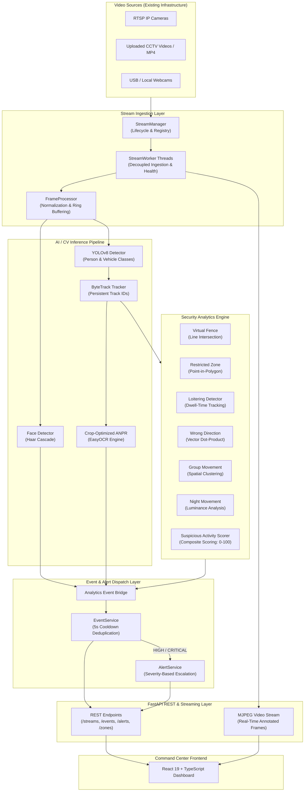

# AI-Based Intelligent Video Analytics Platform for Border Surveillance Using Existing CCTV Infrastructure

### Short Name: IBVAP — Intelligent Border Video Analytics Platform

[](https://www.python.org/)
[](https://fastapi.tiangolo.com/)
[](https://opencv.org/)
[](https://docs.ultralytics.com/)
[](https://react.dev/)
[](https://www.typescriptlang.org/)
[](https://vitejs.dev/)
[](LICENSE)
[](#smart-india-hackathon-sih-2026)

---

## Table of Contents

- [Overview](#overview)
- [Problem Statement](#problem-statement)
- [Objectives](#objectives)
- [Key Features](#key-features)
- [System Architecture](#system-architecture)
- [AI/ML & Computer Vision Pipeline](#aiml--computer-vision-pipeline)
- [Security Analytics Modules](#security-analytics-modules)
  - [1. Virtual Fence / Tripwire Detection](#1-virtual-fence--tripwire-detection)
  - [2. Restricted Zone Entry Detection](#2-restricted-zone-entry-detection)
  - [3. Loitering Detection](#3-loitering-detection)
  - [4. Wrong-Direction Movement Detection](#4-wrong-direction-movement-detection)
  - [5. Group Movement Detection](#5-group-movement-detection)
  - [6. Night-Time Movement Detection](#6-night-time-movement-detection)
  - [7. Face Detection](#7-face-detection)
  - [8. Automatic Number Plate Recognition (ANPR)](#8-automatic-number-plate-recognition-anpr)
  - [9. Multi-Signal Suspicious Activity Scoring](#9-multi-signal-suspicious-activity-scoring)
- [Alert & Event Dispatch System](#alert--event-dispatch-system)
- [Surveillance Dashboard (Frontend)](#surveillance-dashboard-frontend)
- [Camera & Stream Ingestion Support](#camera--stream-ingestion-support)
- [Technology Stack](#technology-stack)
- [Project Structure](#project-structure)
- [Installation & Setup](#installation--setup)
- [Running the Application](#running-the-application)
- [REST API Reference](#rest-api-reference)
- [Testing with Sample CCTV Videos](#testing-with-sample-cctv-videos)
- [Performance Considerations](#performance-considerations)
- [Differentiation from Conventional Surveillance](#differentiation-from-conventional-surveillance)
- [Limitations](#limitations)
- [Future Enhancements](#future-enhancements)
- [Smart India Hackathon (SIH) 2026](#smart-india-hackathon-sih-2026)
- [License](#license)

---

## Overview

**IBVAP (Intelligent Border Video Analytics Platform)** is an AI-powered surveillance platform designed to upgrade existing CCTV and IP camera infrastructure into an intelligent, automated perimeter defense system.

Border Outposts (BOPs), check posts, access roads, and forward defense locations often deploy hundreds of standard optical and infrared CCTV cameras. Traditional surveillance setups rely on continuous human operator monitoring across multiple video walls—a model prone to operator fatigue, missed incursions, and delayed reaction times. Replacing legacy camera networks with dedicated proprietary "smart cameras" is prohibitively expensive, operationally disruptive, and creates vendor lock-in.

IBVAP addresses this challenge through a **software-defined intelligence layer**. By ingesting standard RTSP IP camera streams, local video files, or test feeds, the platform performs real-time computer vision analysis, multi-object tracking, behavioral rule evaluation, and automated threat dispatching without requiring specialized camera hardware.

---

## Problem Statement

Border security agencies operate extensive networks of existing IP-based CCTV cameras along international frontiers and sensitive installations. However:
1. **Passive Recording**: Legacy cameras merely record video footage for post-incident forensic investigation rather than providing proactive real-time detection.
2. **Cognitive Overload**: Human operators cannot monitor multiple camera feeds simultaneously for prolonged shifts without significant drops in attention.
3. **Hardware Replacement Costs**: Discarding functioning camera infrastructure to install proprietary edge-AI cameras requires massive capital expenditure and logistical downtime.
4. **Disjointed Analytics**: Off-the-shelf point solutions rarely combine object detection, multi-object tracking, perimeter tripwires, restricted polygons, loitering detection, direction verification, ANPR, and composite threat scoring into a unified operator dashboard.

IBVAP converts existing IP-based CCTV cameras into an intelligent surveillance system using AI/ML and computer vision, operating directly on standard video feeds.

---

## Objectives

- **Maximize Existing Infrastructure**: Integrate with standard IP cameras (via RTSP), USB/webcam inputs, and recorded video archives without hardware replacement.
- **Automated Real-Time Detection**: Detect, classify, and track security-relevant entities (persons, vehicles, bicycles, motorcycles, buses, trucks) in real time.
- **Configurable Perimeter Intelligence**: Provide operators with interactive tools to define virtual fence lines (tripwires) and polygonal restricted zones with customizable dwell and trajectory thresholds.
- **Behavioral Anomaly Identification**: Identify abnormal behavioral patterns, including loitering, wrong-direction movement, group formations, and movement under low-light/night conditions.
- **Composite Threat Scoring**: Correlate multiple low-level signals into an explainable threat level (Normal, Low, Medium, High, Critical) to eliminate alert fatigue.
- **Unified Command Dashboard**: Present operators with live annotated MJPEG video streams, real-time alert triage, historical event logs, camera health telemetry, and diagnostic metrics.

---

## Key Features

1. **Real-Time Object Detection**: YOLOv8-powered detection of persons, vehicles, and relevant perimeter entities.
2. **Person Detection**: Dedicated classification and tracking of pedestrians and individuals traversing monitored zones.
3. **Vehicle Detection & Classification**: Identification of cars, motorcycles, buses, and trucks moving across border corridors and check posts.
4. **Multi-Object Tracking (ByteTrack)**: Robust multi-object tracking associating stable track IDs across consecutive frames, even through partial occlusions.
5. **Object Trajectory & ID Association**: Centroid trajectory calculation across temporal windows to analyze movement paths and heading vectors.
6. **Virtual Fence / Tripwire Detection**: Vector-based line crossing detection across user-configured coordinate pairs.
7. **Restricted-Zone Perimeter Intrusion**: Point-in-polygon algorithm (`cv2.pointPolygonTest`) to detect unauthorized entry into high-security zones.
8. **Loitering Detection**: Dwell-time tracking that flags subjects remaining inside monitored sectors longer than a configured threshold.
9. **Wrong-Direction Movement Detection**: Vector dot-product analysis comparing object velocity vectors against authorized movement vectors.
10. **Group Movement Detection**: Spatial cluster analysis identifying coordinated movement of multiple subjects within defined proximity thresholds.
11. **Night-Time Movement Detection**: Grayscale luminance evaluation detecting active movement under low-ambient-light conditions.
12. **Face Detection**: Haar-cascade detection identifying human faces in near-field surveillance views.
13. **ANPR (Automatic Number Plate Recognition)**: Crop-optimized EasyOCR pipeline extracting license plate alphanumeric text from detected vehicle bounding boxes with track-level caching.
14. **Real-Time Security Alerts**: Automated escalation of High and Critical security events into prioritized operational alerts.
15. **Event Logging & Audit Trail**: Thread-safe persistent event repository capturing camera origins, timestamps, bounding boxes, and detection details.
16. **Alert Deduplication & Cooldown**: Time-windowed cooldown mechanism (5.0s default) suppressing duplicate alerts from consecutive video frames.
17. **CCTV/IP Camera Stream Processing**: Non-blocking multi-threaded stream ingestion with automatic reconnect, exponential backoff, and frame-rate normalization.
18. **Modern Command Dashboard**: Responsive React/TypeScript web interface for live surveillance, zone management, alert resolution, and health diagnostics.

---

## System Architecture

The following diagram illustrates the complete dataflow and processing pipeline from camera input to the operator dashboard:

```
IP Camera / RTSP stream OR uploaded CCTV video
        ↓
Video Stream Manager
        ↓
OpenCV Frame Processing
        ↓
YOLOv8 Object Detection
        ↓
ByteTrack Object Tracking
        ↓
Analytics Engine
        ↓
 ┌─────────────────────────────┐
 │ Virtual Fence               │
 │ Restricted Zone             │
 │ Loitering                   │
 │ Wrong Direction             │
 │ Group Movement              │
 │ Night Movement              │
 │ Suspicious Activity         │
 │ Face Detection              │
 │ ANPR                        │
 └─────────────────────────────┘
        ↓
Event / Alert Dispatcher
        ↓
FastAPI Backend
        ↓
React Surveillance Dashboard
```

### Architecture Data Flow Details



### Key Architectural Tenet: Decoupled Ingestion & Inference
A central design principle of IBVAP is that **video frame acquisition and AI analytics execution are strictly decoupled onto separate threads**:
- `StreamWorker` continuously captures frames from RTSP or video files into a thread-safe ring buffer, maintaining stream health, drop detection, and connection metrics without blocking.
- `AnalyticsEngine` retrieves frames for inference, tracks objects, evaluates perimeter rules, and publishes events asynchronously.
- Slow network frames or intensive model inferences never deadlock or degrade the underlying video stream ingestion.

---

## AI/ML & Computer Vision Pipeline

```
Raw Frame → Frame Normalization → YOLOv8 Inference → ByteTrack Association → Analytical Rules → Threat Scorer
```

1. **Frame Ingestion & Preprocessing**:
   - Frames are decoded via OpenCV (`cv2.VideoCapture`) with thread-safe circular buffering.
   - Timestamps, frame counts, and instantaneous/average FPS metrics are continuously updated.
2. **Object Detection**:
   - Frames are processed by YOLOv8 (`yolov8n.pt` / `yolo11n.pt`).
   - Relevant classes are filtered: `person`, `bicycle`, `car`, `motorcycle`, `bus`, `truck`, `train`.
   - Bounding box coordinates, class labels, and confidence values are extracted.
3. **Multi-Object Tracking (ByteTrack)**:
   - Detections are correlated across frames using ByteTrack (`bytetrack.yaml`).
   - Each tracked subject receives a persistent `track_id` retained through brief occlusions.
   - Historical centroids are recorded to maintain motion trajectory history.
4. **Parallel Analytics Evaluation**:
   - The tracked bounding boxes and centroids are simultaneously evaluated against active perimeter geometry (fences, zones, direction vectors).
5. **Specialized Inference Modules**:
   - Near-field human crops are evaluated for facial presence.
   - Detected vehicle bounding boxes are cropped and routed to the ANPR engine.
6. **Composite Threat Assessment**:
   - Detected rule violations are scored and aggregated into a composite risk level.
7. **Frame Annotation & Streaming**:
   - Bounding boxes, track IDs, tripwire lines, zone polygons, and active alerts are rendered directly onto the video frame and served as an annotated MJPEG stream.

---

## Security Analytics Modules

### 1. Virtual Fence / Tripwire Detection
- **Mechanism**: Operators define a virtual line segment between two coordinates $(x_1, y_1)$ and $(x_2, y_2)$.
- **Algorithm**: The system evaluates the 2D cross-product between the object centroid and the line vector across consecutive frames:
  $$\text{Cross Product} = (x_2 - x_1)(y_c - y_1) - (y_2 - y_1)(x_c - x_1)$$
- **Trigger**: A sign transition in the cross-product indicates that the tracked entity crossed from one side of the virtual boundary to the other, generating a `virtual_fence_crossing` event.

### 2. Restricted Zone Entry Detection
- **Mechanism**: Security zones are defined as arbitrary polygonal regions $[(x_1, y_1), (x_2, y_2), \dots, (x_n, y_n)]$.
- **Algorithm**: Uses OpenCV's `cv2.pointPolygonTest` on the center coordinate of each tracked bounding box against the polygon contour.
- **Trigger**: Any tracked subject whose centroid falls inside or on the boundary generates a `restricted_zone_entry` event.

### 3. Loitering Detection
- **Mechanism**: Monitors spatial dwell time to detect individuals or vehicles remaining in sensitive sectors longer than authorized.
- **Algorithm**: The platform records the initial timestamp (`first_seen`) for every active `track_id`. If the entity remains continuously active within the surveillance sector for duration:
  $$\Delta t = t_{\text{current}} - t_{\text{first\_seen}} \ge \text{threshold\_seconds}$$
- **Trigger**: An automated `loitering` event is emitted. An internal state flag prevents repeated triggers for the same track until the subject leaves.

### 4. Wrong-Direction Movement Detection
- **Mechanism**: Enforces one-way security lanes, checkpoint ingress/egress routes, and authorized patrol directions.
- **Algorithm**: Compares the displacement vector of a tracked entity $\vec{v} = (x_{\text{curr}} - x_{\text{prev}}, y_{\text{curr}} - y_{\text{prev}})$ against a normalized expected direction vector $\vec{u}$:
  $$\text{Dot Product} = \vec{v} \cdot \vec{u} = v_x u_x + v_y u_y$$
- **Trigger**: When the displacement exceeds the minimum travel distance and the dot product is negative ($\vec{v} \cdot \vec{u} < 0$), the entity is moving contrary to the authorized flow, generating a `wrong_direction` event.

### 5. Group Movement Detection
- **Mechanism**: Identifies abnormal gatherings or coordinated group breaches along border perimeter lines.
- **Algorithm**: Evaluates pairwise Euclidean distances between centroids of all active tracked subjects:
  $$d(p_i, p_j) = \sqrt{(x_i - x_j)^2 + (y_i - y_j)^2}$$
- **Trigger**: When the number of subjects clustered within a spatial threshold (e.g., $120\text{ px}$) reaches or exceeds the configured minimum group size (default: 3), a `group_movement` event is registered.

### 6. Night-Time Movement Detection
- **Mechanism**: Detects movement in unlit or low-visibility perimeter zones during night surveillance operations.
- **Algorithm**: Computes the mean luminance across the grayscale frame:
  $$\mu_L = \frac{1}{W \times H} \sum_{x,y} I(x, y)$$
- **Trigger**: When the scene brightness falls below the night threshold ($\mu_L < 60.0$) and moving tracked objects are detected, a `night_movement` event is generated.

### 7. Face Detection
- **Mechanism**: Inspects near-field surveillance views for human presence using Haar Cascade classifiers (`haarcascade_frontalface_default.xml`).
- **Trigger**: Emits `face_detected` events with bounding box coordinates for operator awareness.

### 8. Automatic Number Plate Recognition (ANPR)
- **Mechanism**: Extracts alphanumeric license plate text from detected vehicle bounding boxes.
- **Optimizations**:
  - **Crop-Based Execution**: Runs OCR strictly on cropped vehicle bounding boxes (cars, trucks, buses, motorcycles), avoiding expensive full-frame OCR.
  - **Track-Level Caching**: Caches recognized plate results against the vehicle's `track_id` to eliminate repetitive per-frame OCR computations.
  - **Fault-Tolerant Fallback**: EasyOCR initializes lazily and handles missing characters or poor lighting gracefully without halting stream processing.

### 9. Multi-Signal Suspicious Activity Scoring
Instead of overwhelming operators with isolated alarms, the `SuspiciousActivityScorer` combines multiple behavioral signals into an explainable 0–100 composite risk score:

| Signal Type | Weight | Explanation |
| :--- | :---: | :--- |
| **Restricted Zone Entry** | `+40 pts` | Unauthorized intrusion into critical security sector |
| **Virtual Fence Breach** | `+35 pts` | Physical tripwire boundary crossing |
| **Wrong Direction** | `+25 pts` | Movement counter to authorized ingress/egress |
| **Loitering Presence** | `+20 pts` | Prolonged stationary presence exceeding threshold |
| **Night Movement** | `+20 pts` | Movement detected under low-light/covert conditions |
| **Group Formation** | `+15 pts` | Multiple individuals gathering along border line |

**Risk Level Mapping**:
- `0 – 24 pts`: **NORMAL**
- `25 – 49 pts`: **LOW RISK**
- `50 – 69 pts`: **MEDIUM RISK**
- `70 – 84 pts`: **HIGH RISK**
- `85 – 100 pts`: **CRITICAL**

When composite risk reaches **HIGH** or **CRITICAL**, an immediate high-priority security alert is dispatched with human-readable rationale (e.g., *"Restricted border zone entry + Prolonged loitering"*).

---

## Alert & Event Dispatch System

IBVAP implements a structured, two-tier event and alert pipeline:

```
Analytics Detector → Analytics Event Bridge → EventService → AlertService → Operator Notification
```

1. **Events vs. Alerts**:
   - **Events**: Low-level forensic occurrences (`face_detected`, `plate_detected`, `group_movement`, `loitering`, etc.) recorded in the persistent event audit log.
   - **Alerts**: Operational alarms generated automatically when an event carries **HIGH** or **CRITICAL** severity (e.g., virtual fence breaches, restricted zone entries, high composite threat scores).
2. **Alert Fields & Metadata**:
   - `id`: Unique incremental identifier.
   - `camera_id`: Source camera identifier (e.g., `CAM-001`, `BOP-NORTH-04`).
   - `event_type`: Categorical event code.
   - `severity`: Priority classification (`LOW`, `MEDIUM`, `HIGH`, `CRITICAL`).
   - `status`: Lifecycle state (`ACTIVE` or `RESOLVED`).
   - `timestamp`: ISO-8601 UTC timestamp of occurrence.
   - `confidence`: AI detection confidence metric.
   - `details`: Contextual metadata including bounding boxes, track IDs, durations, and rule parameters.
3. **Deduplication & Cooldown**:
   - In video surveillance, an intruder lingering near a boundary would otherwise generate dozens of duplicate events per second.
   - IBVAP maintains a composite deduplication key: `camera_id:event_type:severity`.
   - A configurable cooldown window (default: **5.0 seconds**) suppresses identical consecutive triggers, ensuring clean, actionable alert streams for operators.
4. **Alert Triage & Resolution**:
   - Operators can review active alerts in real time and mark them as `RESOLVED` with a single click, recording an audit trail for shift handovers.

---

## Surveillance Dashboard (Frontend)

The frontend is a responsive web application built with **React 19**, **TypeScript**, and **Vite**, featuring a dark command-center aesthetic tailored for surveillance control rooms.

### Implemented Pages & Views

| Page / Section | Route | Purpose & Operational Features |
| :--- | :--- | :--- |
| **Dashboard** | `/` | Operational overview with high-level KPI cards (Active Cameras, Alerts, Total Events, Persons & Vehicles detected), camera preview grid, quick connection shortcuts, and recent activity logs. |
| **Live Surveillance** | `/surveillance` | Primary tactical monitoring workstation. Features an interactive camera selector, live annotated MJPEG stream player, detection toggle controls, real-time telemetry counters, active perimeter alerts, and snapshot capture. |
| **Live Cameras** | `/cameras` | Multi-camera management grid displaying live cards for all registered streams, connection status badges, frame rate counters, dropped frame metrics, and connect/disconnect controls. |
| **Security Alerts** | `/alerts` | Dedicated incident management center. Displays active and resolved alerts with severity badges (`CRITICAL`, `HIGH`, `MEDIUM`, `LOW`), camera origin, timestamp, detection details, and one-click alert resolution. |
| **Event Audit Trail** | `/events` | Comprehensive chronological event ledger logging every detected rule trigger, fence crossing, zone breach, and loitering occurrence with filtering by camera and severity. |
| **Zones & Fences** | `/zones` | Boundary configuration interface allowing operators to view and update virtual fence lines (tripwires) and restricted polygon coordinates per camera. |
| **System Health** | `/health` | Diagnostic console tracking platform status, backend uptime, active camera threads, dropped frames, reconnect attempts, and worker status. |
| **Analytics Summary** | `/analytics` | Aggregated intelligence metrics, breakdown of detected entities (persons vs. vehicles), threat level distributions, and event severity charts. |
| **Settings** | `/settings` | Platform runtime configuration displaying backend API base URLs, polling frequencies, alert cooldown periods, and environment parameters. |

### Key UI Components

- **`CameraCard.tsx`**: Individual stream card rendering live preview snapshots, status badges, resolution, real-time FPS, uptime, and control buttons.
- **`CameraGrid.tsx`**: Responsive grid container organizing multi-camera feeds across monitoring sectors.
- **`ConnectCameraModal.tsx`**: Modal dialog for onboarding new camera feeds—supports RTSP URLs, local MP4 file paths, and webcam device indices with location and sector tags.
- **`VirtualFenceModal.tsx`**: Interactive modal for updating virtual fence coordinate pairs and restricted zone polygon vertices.
- **`AlertPanel.tsx`**: Real-time floating/embedded notification panel highlighting high-severity perimeter alarms.
- **`Sidebar.tsx`**: Navigation menu providing routing between all platform views and a global "Connect Camera" button.
- **`Topbar.tsx`**: Command header displaying system branding, live backend connectivity indicator, manual refresh button, and quick-access controls.
- **`StatusBadge.tsx`**: Semantic visual indicator reflecting stream lifecycle states (`ONLINE`, `OFFLINE`, `RECONNECTING`, `ERROR`).
- **`StatCard.tsx`**: Metric display cards presenting counts of active cameras, alerts, events, and detected entities.

---

## Camera & Stream Ingestion Support

IBVAP is designed to ingest standard video streams without requiring vendor-specific proprietary hardware:

1. **Existing CCTV / IP Cameras**:
   - Ingests standard **H.264 / H.265** video feeds over **RTSP** (`rtsp://username:password@ip:port/h264Preview_01_main`).
   - Compatible with major commercial security camera brands (Hikvision, Dahua, Axis, CP Plus, Hanwha, Uniview, Bosch) supporting RTSP.
2. **Local & Uploaded CCTV Video Files**:
   - Supports recorded MP4, AVI, and MKV video files for testing, system evaluation, demonstration, and forensic re-analysis.
   - Includes automatic loop playback (`loop_video: true`) for continuous simulation.
   - Built-in video upload endpoint (`POST /streams/upload`) stores sample CCTV footage directly in the `samples/` directory.
3. **Direct Webcam & Capture Cards**:
   - Ingests USB webcams and HDMI capture cards using integer device indices (e.g., `source_url: "0"`).
4. **Resilient Multi-Stream Architecture**:
   - Each registered stream executes in its own isolated `StreamWorker` thread.
   - Includes automatic drop detection: if no frames are received within `STREAM_TIMEOUT_SEC` (default: 5.0s), the camera transitions to `RECONNECTING`.
   - Automatically reconnects with exponential backoff up to `MAX_RECONNECT_ATTEMPTS` before marking the stream as `ERROR`.

---

## Technology Stack

### Backend
- **Python 3.10+ / 3.12**: Core runtime environment.
- **FastAPI**: High-performance asynchronous REST API framework and streaming server.
- **Uvicorn**: ASGI web server implementation.
- **OpenCV (opencv-python-headless 4.10)**: Video stream decoding, frame normalization, geometric algorithms, and image processing.
- **YOLOv8 / Ultralytics (8.4.140)**: State-of-the-art object detection for perimeter security classes.
- **PyTorch**: Deep learning execution backend for YOLO and EasyOCR.
- **ByteTrack**: Multi-object association and tracking algorithm.
- **EasyOCR (1.7.1)**: Optical character recognition engine for vehicle license plate extraction.
- **NumPy (1.24+)**: Matrix and vector mathematics for geometry and trajectory evaluation.
- **Pydantic (2.6+)**: Data validation, schema definitions, and application settings.

### Frontend
- **React 19**: Modern component-based user interface library.
- **TypeScript**: Type-safe frontend application code.
- **Vite 8**: Fast frontend build tooling and development server.
- **React Router DOM 7**: Client-side routing across dashboard views.
- **Pure Vanilla CSS**: Modular, dark-theme surveillance design system without heavy framework dependencies.

### Protocols & Tools
- **REST APIs**: JSON-based platform configuration and event queries.
- **MJPEG Streaming**: Multipart JPEG video streaming over HTTP (`multipart/x-mixed-replace`).
- **RTSP**: Real-Time Streaming Protocol for IP camera ingestion.
- **Git & GitHub**: Version control and source code collaboration.
- **Pytest**: Automated backend test suite.

---

## Project Structure

```
IBVAP-Intelligent-Border-Video-Analytics-Platform/
├── backend/
│   ├── analytics/                      # Security analytics detector implementations
│   │   ├── __init__.py
│   │   ├── group_movement.py           # Spatial clustering & group movement detection
│   │   ├── loitering.py                # Dwell-time loitering detector
│   │   ├── night_movement.py           # Low-light / luminance analysis detector
│   │   ├── restricted_zone.py          # Point-in-polygon zone intrusion detector
│   │   ├── suspicious_activity.py      # Multi-signal composite threat scoring engine
│   │   ├── virtual_fence.py            # Line-crossing / tripwire detector
│   │   └── wrong_direction.py          # Trajectory vector dot-product detector
│   ├── api/                            # FastAPI route definitions
│   │   ├── __init__.py
│   │   ├── alerts.py                   # Alert query and resolution endpoints
│   │   ├── analytics.py                # Aggregated intelligence metrics & single-frame analysis
│   │   ├── events.py                   # Event logging and query endpoints
│   │   ├── health.py                   # System health, uptime, and camera count
│   │   ├── intelligence.py             # Virtual fence and zone configuration APIs
│   │   ├── streams.py                  # Stream connection, MJPEG streaming, snapshot & upload APIs
│   │   └── zones.py                    # Camera zone geometry management APIs
│   ├── inference/                      # Deep learning and vision inference modules
│   │   ├── __init__.py
│   │   ├── anpr.py                     # Crop-optimized EasyOCR license plate recognition
│   │   ├── face_detector.py            # Haar-cascade facial presence detector
│   │   ├── tracker.py                  # YOLOv8 + ByteTrack object tracker
│   │   └── yolo_detector.py            # YOLO model wrapper and bounding box parsing
│   ├── models/                         # Pydantic schemas and domain models
│   │   ├── __init__.py
│   │   ├── alert.py                    # Alert, Severity, and AlertStatus schemas
│   │   ├── camera.py                   # StreamConnectRequest, StreamHealth, StreamInfo schemas
│   │   ├── detection.py                # BoundingBox and DetectionResult dataclasses
│   │   ├── event.py                    # Event and CreateEventRequest schemas
│   │   └── zone.py                     # ZoneConfig, Point, and MovementTrack schemas
│   ├── services/                       # Application services and background workers
│   │   ├── __init__.py
│   │   ├── alert_service.py            # Thread-safe alert lifecycle management
│   │   ├── analytics_engine.py         # Unified video analytics orchestration pipeline
│   │   ├── analytics_event_bridge.py   # Event normalization and translation bridge
│   │   ├── event_service.py            # Event persistence with 5s cooldown deduplication
│   │   ├── frame_processor.py          # Frame normalization and snapshot formatting
│   │   ├── intelligence_service.py     # High-level zone rules and event correlation
│   │   ├── stream_manager.py           # Multi-camera registry and MJPEG generator
│   │   └── stream_worker.py            # Dedicated background camera ingestion thread
│   └── main.py                         # FastAPI application entry point, CORS, and lifecycle
├── config/
│   ├── __init__.py
│   └── settings.py                     # Centralized settings with environment variable support
├── frontend/                           # React + TypeScript command center dashboard
│   ├── public/                         # Static assets
│   ├── src/
│   │   ├── api/                        # HTTP client wrappers (streams, events, alerts, health)
│   │   ├── components/                 # Reusable UI components (CameraCard, Topbar, Sidebar, modals)
│   │   ├── hooks/                      # Custom React hooks (useHealth, useStreams)
│   │   ├── pages/                      # Dashboard, LiveSurveillance, Alerts, Events, Zones, Health
│   │   ├── App.css                     # Command center design system and theme styles
│   │   ├── App.tsx                     # Main layout and client-side routing
│   │   ├── index.css                   # Global CSS resets and typography
│   │   └── main.tsx                    # React application entry point
│   ├── index.html                      # HTML document shell
│   ├── package.json                    # Frontend dependencies and scripts
│   ├── tsconfig.json                   # TypeScript project configuration
│   └── vite.config.ts                  # Vite bundler configuration
├── samples/                            # Sample CCTV footage for demonstration and evaluation
│   ├── Sample for CCTV.mp4
│   ├── Sample2 for CCTV.mp4
│   ├── Sample3 class for CCTV.mp4
│   ├── Sample4 class movement for CCTV.mp4
│   ├── Sample5 class loitering for CCTV.mp4
│   ├── Sample6 class cut for CCTV.mp4
│   ├── Sample7 class adit for CCTV.mp4
│   └── test_border_feed.mp4
├── scripts/
│   ├── __init__.py
│   └── generate_sample_cctv.py         # Utility script to generate synthetic test CCTV videos
├── tests/                              # Automated test suite
│   ├── __init__.py
│   ├── conftest.py                     # Shared pytest fixtures and mock generators
│   ├── test_alerts_api.py              # Alert endpoint integration tests
│   ├── test_events_api.py              # Event logging and query tests
│   ├── test_frame_processor.py         # Frame normalization tests
│   ├── test_health.py                  # Health check tests
│   ├── test_intelligence.py            # Perimeter rules and correlation tests
│   ├── test_stream_worker.py           # Ingestion thread failure and reconnect tests
│   └── test_streams_api.py             # Camera stream lifecycle tests
├── LICENSE                             # MIT Open-Source License
├── pytest.ini                          # Pytest configuration
├── requirements.txt                    # Python backend dependencies
└── README.md                           # Project documentation
```

---

## Installation & Setup

### Prerequisites
- **Operating System**: Windows 10/11 (also compatible with Linux and macOS)
- **Python**: Version 3.10 to 3.12
- **Node.js**: Version 18+ or 20+ (with npm)
- **Git**: Installed and available in your command path

### Step 1: Clone the Repository

Open Command Prompt or PowerShell:

```cmd
git clone https://github.com/om-saxena34/IBVAP-Intelligent-Border-Video-Analytics-Platform.git
cd IBVAP-Intelligent-Border-Video-Analytics-Platform
```

### Step 2: Backend Setup (Python Virtual Environment)

1. Create a Python virtual environment:
   ```cmd
   python -m venv venv
   ```

2. Activate the virtual environment:
   - On Windows (PowerShell):
     ```powershell
     .\venv\Scripts\Activate.ps1
     ```
   - On Windows (Command Prompt):
     ```cmd
     venv\Scripts\activate.bat
     ```

3. Upgrade `pip` and install backend dependencies:
   ```cmd
   python -m pip install --upgrade pip
   pip install -r requirements.txt
   ```

> **Note on YOLO Models**: On first execution, Ultralytics will automatically download the lightweight `yolov8n.pt` / `yolo11n.pt` weights if not already present in the project root.

### Step 3: Frontend Setup (React Dashboard)

Open a second terminal window, navigate to the `frontend` folder, and install dependencies:

```cmd
cd frontend
npm install
```

---

## Running the Application

### 1. Start the Backend Server

From the project root directory (with your Python virtual environment activated):

```cmd
python -m uvicorn backend.main:app --host 127.0.0.1 --port 8000 --reload
```

- **Backend API Root**: `http://127.0.0.1:8000`
- **Interactive Swagger Documentation**: `http://127.0.0.1:8000/docs`
- **Alternative ReDoc Documentation**: `http://127.0.0.1:8000/redoc`

### 2. Start the Frontend Surveillance Dashboard

From the `frontend` directory:

```cmd
cd frontend
npm run dev
```

The Vite development server will launch at:
- **Command Dashboard**: `http://localhost:5173`

Open `http://localhost:5173` in any modern web browser (Google Chrome, Microsoft Edge, Mozilla Firefox) to access the surveillance interface.

### 3. Running Automated Tests

To run the backend test suite verifying stream workers, alert deduplication, and API endpoints:

```cmd
pytest -v
```

---

## REST API Reference

The FastAPI backend exposes clean, documented REST and streaming endpoints. Below is a summary of primary routes:

### Stream Management (`/streams`)
- `POST /streams/connect`: Connect a new camera source (RTSP, local MP4 file, or webcam).
- `POST /streams/upload`: Upload an MP4 video file to the server's `samples/` directory.
- `GET /streams`: List all registered camera streams with real-time health metrics.
- `GET /streams/{camera_id}`: Retrieve metadata and status for a specific camera.
- `GET /streams/{camera_id}/health`: Query real-time FPS, frame counts, dropped frames, and connection status.
- `GET /streams/{camera_id}/detections`: Query latest structured detection telemetry (classes, bounding boxes, track IDs).
- `GET /streams/{camera_id}/live`: MJPEG live video stream with real-time AI bounding boxes, tracking labels, and zones (`?annotated=true`).
- `GET /streams/{camera_id}/snapshot`: Fetch the latest decoded video frame as a JPEG image.
- `POST /streams/{camera_id}/disconnect`: Terminate stream worker and release capture resources.

### Events & Alerts (`/events`, `/alerts`)
- `GET /events`: Retrieve all detected events with optional `camera_id` filter.
- `POST /events`: Manually log a detected event (escalates to alert if `HIGH` or `CRITICAL`).
- `GET /alerts`: Retrieve all security alerts with optional `camera_id`, `status` (`ACTIVE`/`RESOLVED`), and `severity` filters.
- `POST /alerts/{alert_id}/resolve` / `PATCH /alerts/{alert_id}/resolve`: Mark an active alert as resolved.

### Perimeter Intelligence & Zones (`/intelligence`, `/intelligence/zones`)
- `GET /intelligence/zones/all`: List all active virtual fences and restricted zones across cameras.
- `POST /intelligence/zones`: Create or update a virtual fence line or restricted polygon boundary.
- `DELETE /intelligence/zones/{zone_id}`: Remove a configured perimeter boundary.

### System Diagnostics & Analytics (`/health`, `/analytics`)
- `GET /health`: Platform operational status, server uptime, and online camera count.
- `GET /analytics/summary`: Consolidated statistics including total detections, persons/vehicles count, and severity distributions.
- `POST /analytics/frame`: Upload an individual image frame for direct ad-hoc computer vision analysis.

---

## Testing with Sample CCTV Videos

The repository includes a dedicated `samples/` directory containing sample surveillance MP4 videos for testing and demonstration without requiring a physical CCTV setup:

- `samples/test_border_feed.mp4`: Lightweight border outpost test clip.
- `samples/Sample for CCTV.mp4`: Standard perimeter monitoring scenario.
- `samples/Sample2 for CCTV.mp4`: Extended multi-subject activity feed.
- `samples/Sample3 class for CCTV.mp4`: Vehicle and pedestrian classification test.
- `samples/Sample4 class movement for CCTV.mp4`: Trajectory and direction tracking test.
- `samples/Sample5 class loitering for CCTV.mp4`: Prolonged stationary loitering scenario.
- `samples/Sample6 class cut for CCTV.mp4`: Perimeter fence approach scenario.
- `samples/Sample7 class adit for CCTV.mp4`: Checkpoint ingress/egress scenario.

### How to Connect a Sample Video

#### Option A: Using the Web Dashboard (Recommended)
1. Open the dashboard at `http://localhost:5173`.
2. Click **"+ Connect Camera"** in the sidebar or topbar.
3. Fill in the connection form:
   - **Camera ID**: e.g., `CAM_SAMPLE_01`
   - **Source Type**: Select `FILE`
   - **Source URL / File Path**: `samples/Sample for CCTV.mp4` (or `samples/test_border_feed.mp4`)
   - **Location**: e.g., `Sector 4 North Checkpoint`
   - **Loop Video**: Checked (`true`)
4. Click **"Connect Camera"**.
5. Navigate to **Live Surveillance** to watch the real-time AI bounding boxes, track IDs, and perimeter alerts.

#### Option B: Using cURL or REST Client
```bash
curl -X POST http://127.0.0.1:8000/streams/connect \
  -H "Content-Type: application/json" \
  -d '{
    "camera_id": "CAM_SAMPLE_01",
    "source_url": "samples/Sample for CCTV.mp4",
    "source_type": "FILE",
    "location": "BOP North Gate Alpha",
    "sector": "Sector 4",
    "loop_video": true
  }'
```

---

## Performance Considerations

In video analytics and computer vision systems, actual operational throughput and processing latency depend on several environmental and hardware factors rather than fixed theoretical figures:

- **Host Hardware (CPU vs. GPU)**: Running YOLOv8 and PyTorch on an NVIDIA CUDA-enabled GPU provides substantially higher frame throughput compared to CPU-only execution.
- **Input Stream Resolution**: Ingesting high-definition feeds (1080p / 4K) requires greater decoding and inference bandwidth than standard surveillance resolutions (480p / 720p).
- **Concurrent Camera Streams**: Each active camera worker operates on an independent thread; the maximum number of simultaneous real-time streams scales with available CPU cores and GPU VRAM.
- **Inference Model Selection**: Lightweight models (`yolov8n.pt`, `yolo11n.pt`) prioritize low latency and real-time processing, whereas larger variants (`yolov8m`, `yolov8x`) offer higher precision at greater computational cost.
- **Active Analytical Modules**: Enabling crop-based OCR (ANPR) or dense clustering adds processing overhead per detected vehicle compared to running basic object detection and virtual fence checks alone.
- **Network Stability**: RTSP stream stability over long-distance wireless links depends on packet loss, bandwidth availability, and network jitter.

---

## Differentiation from Conventional Surveillance

| Feature | Conventional CCTV Setup | Proprietary Smart Cameras | IBVAP Platform |
| :--- | :--- | :--- | :--- |
| **Hardware Requirement** | Standard CCTV cameras | Expensive proprietary smart cameras | **Works with existing IP/CCTV cameras** |
| **Capital Expenditure** | Low (existing infrastructure) | Very High (complete hardware replacement) | **Zero hardware replacement required** |
| **Monitoring Mechanism** | Manual human observation | Camera-embedded edge alerts | **Centralized automated AI orchestration** |
| **Object Tracking** | None (pure recording) | Basic per-camera tracking | **ByteTrack multi-object persistent tracking** |
| **Perimeter Boundary Logic** | Fixed hardware sensors | Vendor-locked proprietary tools | **Dynamic software-defined fences & polygons** |
| **Behavioral Analytics** | None | Limited motion detection | **Loitering, wrong direction, group, night analysis** |
| **Threat Scoring** | None | Binary motion trigger | **Multi-signal composite risk scoring (0–100)** |
| **Alert Management** | Manual review | High false-alarm rate | **5s cooldown deduplication & active triage** |
| **Operator Interface** | Standard NVR video wall | Proprietary vendor software | **Modern web-based command dashboard** |

---

## Limitations

- **Environmental & Scene Dependency**: Optical detection accuracy is inherently affected by extreme weather conditions (dense fog, torrential rain, heavy dust storms), severe camera glare, low camera angles, and physical line-of-sight occlusions.
- **License Plate Readability (ANPR)**: Automatic Number Plate Recognition relies on adequate pixel resolution, readable camera angles, and sufficient illumination; highly degraded, obscured, or non-standard plates may yield partial or absent readings.
- **Rule-Based Behavioral Inference**: Suspicious activity scoring uses multi-signal heuristic rules and trajectory vectors; it does not replace human operational judgement in complex tactical scenarios.
- **Resource Constraints on CPU**: Running multiple simultaneous camera feeds with deep learning models on entry-level CPU-only hardware will experience reduced effective analytics frame rates.
- **Prototype Implementation**: The current software release is an evaluated research prototype designed for demonstration, hackathon evaluation, and pilot deployments; production mission-critical deployments require distributed cluster scaling, database persistence, and hardware-accelerated edge gateways.

---

## Future Enhancements

- **Hardware Acceleration**: Integration with TensorRT and ONNX Runtime for optimized sub-millisecond inference on NVIDIA Jetson and edge GPU accelerators.
- **Low-Light & Thermal Camera Fusion**: Specialized computer vision pipelines for thermal imaging (FLIR) and infrared (IR) night-vision feeds.
- **Custom Border Datasets**: Fine-tuning YOLO models on domain-specific border defense datasets (camouflage gear, border patrol vehicles, specialized equipment).
- **Indian ANPR Localization**: Training custom character recognition models optimized for diverse Indian high-security registration plates (HSRP) and state variations.
- **Cross-Camera Re-Identification (Re-ID)**: Global feature embeddings to track subjects seamlessly across non-overlapping camera fields of view.
- **Database Persistence**: Migration of event and alert stores from memory to scalable databases (PostgreSQL / TimescaleDB) for historical analytics.
- **Role-Based Access Control (RBAC)**: Multi-tenant operator authentication, shift logging, and encrypted audit trails.
- **Automated Incident Dispatch**: Webhook integrations for automated SMS, email, and radio dispatch to field response teams upon Critical perimeter breaches.

---

## Smart India Hackathon (SIH) 2026

- **Initiative**: Smart India Hackathon 2026 (Software Edition)
- **Problem Statement ID**: `SIH26187`
- **Problem Title**: AI-Based Intelligent Video Analytics Platform for Border Surveillance using existing CCTV infrastructure
- **Sponsoring Organization**: Ministry of Home Affairs (MHA)
- **Category**: Software / AI / Computer Vision / Homeland Security

---

## License

This project is licensed under the **MIT License** — see the [LICENSE](LICENSE) file for complete details.

```
Copyright (c) 2026 Om Saxena

Permission is hereby granted, free of charge, to any person obtaining a copy
of this software and associated documentation files (the "Software"), to deal
in the Software without restriction...
```
